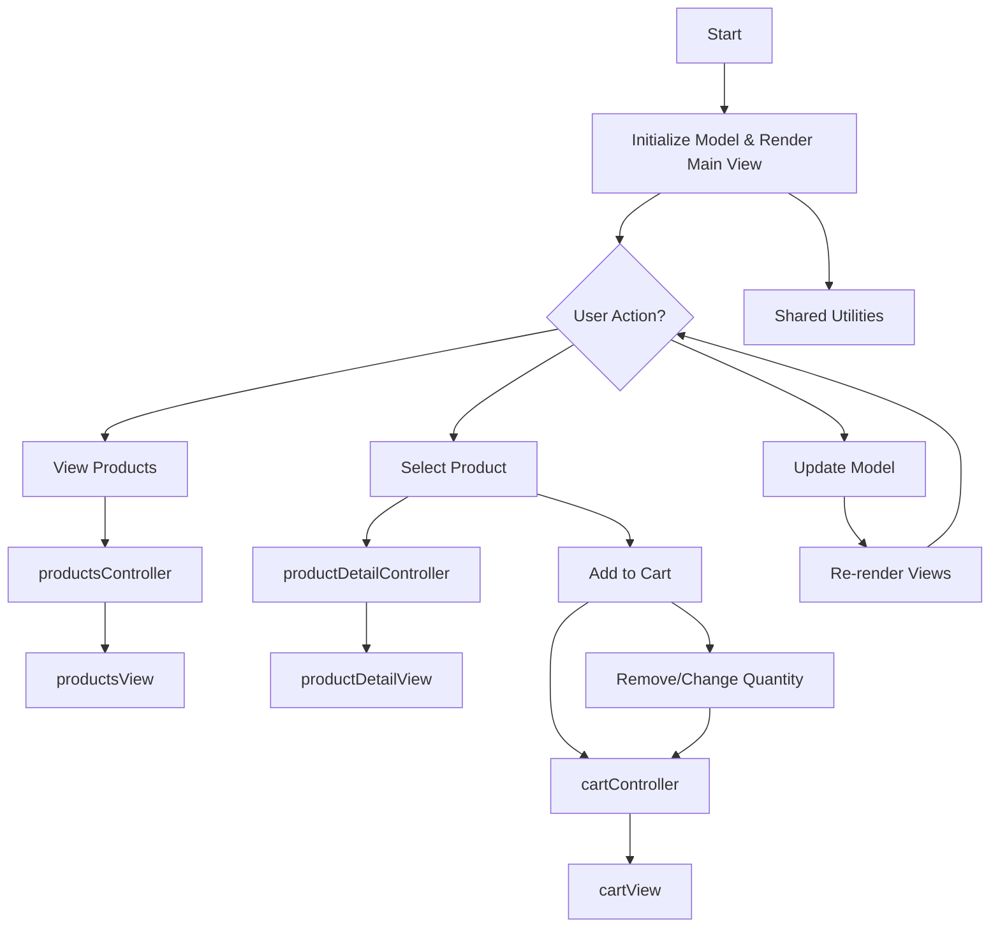

# Kurv App Flowchart

This flowchart describes the main logic and data flow in the Kurv shopping cart application. User actions are handled by controllers, which update the model and trigger view re-rendering.
