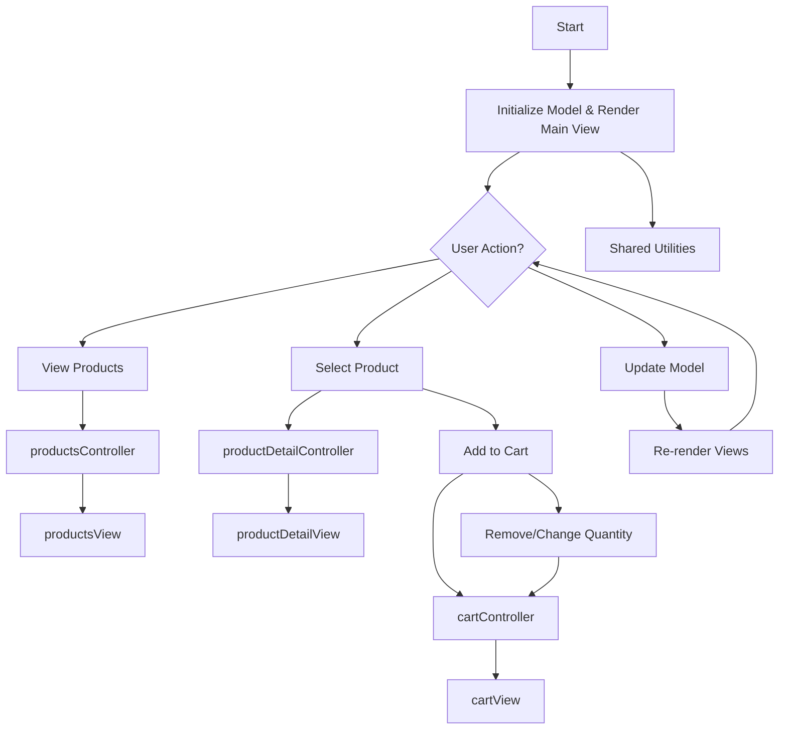

# Kurv App Flowchart

[Kurv App]
   |
   |---> [Products API / Database]   (fetches product data)
   |
   |---> [Payment Service]           (handles checkout/payment)
   |
   |---> [User Auth Service]         (manages user login/session)
   |
   |---> [Other Internal Modules]
           |---> [Controllers]
           |---> [Views]
           |---> [Shared Utilities]

graph TD
    A[Kurv App] --> B[Products API / Database]
    A --> C[Payment Service]
    A --> D[User Auth Service]
    A --> E[Controllers]
    A --> F[Views]
    A --> G[Shared Utilities]

This flowchart describes the main logic and data flow in the Kurv shopping cart application. User actions are handled by controllers, which update the model and trigger view re-rendering.
