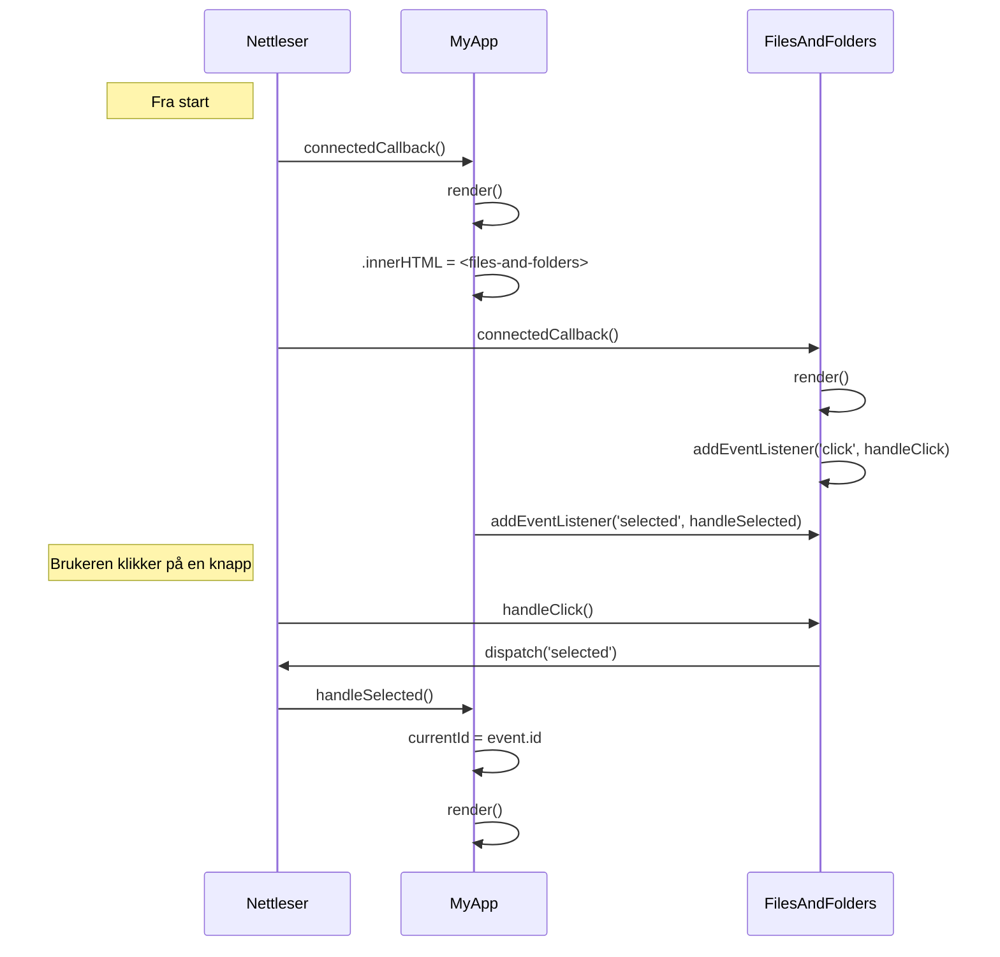

Lag egne sekvensdiagram på

- https://www.websequencediagrams.com/
- https://www.planttext.com/

```mermaid
sequenceDiagram
    participant Nettleser
    participant MyApp
    participant FilesAndFolders

    Note left of Nettleser: Fra start

    Nettleser ->> MyApp: connectedCallback()
    MyApp ->> MyApp: render()
    MyApp ->> MyApp: .innerHTML = <files-and-folders>
    Nettleser ->> FilesAndFolders: connectedCallback()
    FilesAndFolders ->> FilesAndFolders: render()
    FilesAndFolders ->> FilesAndFolders: addEventListener('click', handleClick)
    MyApp ->> FilesAndFolders: addEventListener('selected', handleSelected)

    Note left of Nettleser: Brukeren klikker på en knapp

    Nettleser ->> FilesAndFolders: handleClick()
    FilesAndFolders ->> Nettleser: dispatch('selected')
    Nettleser ->> MyApp: handleSelected()
    MyApp ->> MyApp: currentId = event.id
    MyApp ->> MyApp: render()
```