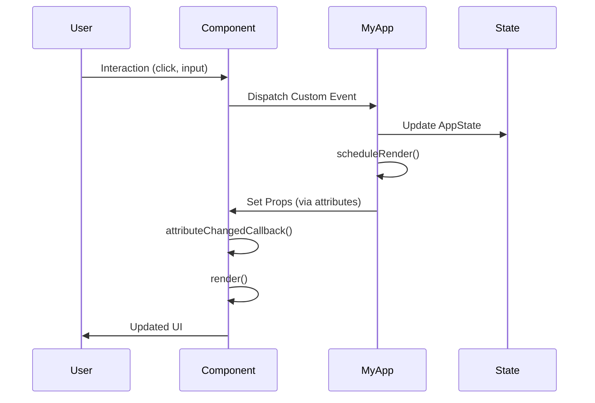

# Data Flow Chart - fromZero Project

## Component Architecture with Props and Events

```mermaid
flowchart TB
    %% Main Application Container
    MyApp[MyApp View<br/>State Container]
    
    %% Components
    FilesAndFolders[FilesAndFolders Component]
    AddFileOrFolder[AddFileOrFolder Component]
    DeleteFileOrFolder[DeleteFileOrFolder Component]
    TrashBin[TrashBin Component]
    
    %% MyApp State
    State[(AppState:<br/>- currentId<br/>- filesAndFolders[]<br/>- markedFilesAndFolders)]
    
    %% Props Flow (Data Down)
    MyApp -->|props: items| FilesAndFolders
    MyApp -->|props: parent-folder| FilesAndFolders
    MyApp -->|props: marked-files-and-folders| FilesAndFolders
    MyApp -->|props: items| TrashBin
    MyApp -->|props: marked-files-and-folders| TrashBin
    
    %% Conditional Rendering
    MyApp -.->|conditional render<br/>if marked > 0| DeleteFileOrFolder
    
    %% Events Flow (Events Up)
    FilesAndFolders -->|event: selected<br/>detail: fileId| MyApp
    FilesAndFolders -->|event: marked-file-or-folder-changed<br/>detail: {id, isChecked}| MyApp
    
    AddFileOrFolder -->|event: content-added<br/>detail: {name, isFile}| MyApp
    
    DeleteFileOrFolder -->|event: delete-file-or-folder| MyApp
    DeleteFileOrFolder -->|event: cancel-delete| MyApp
    
    TrashBin -->|event: restore-item<br/>detail: itemId| MyApp
    TrashBin -->|event: empty-trash| MyApp
    
    %% State Management
    MyApp <-->|reads/writes| State
    
    %% Styling
    classDef stateClass fill:#e1f5ff,stroke:#01579b,stroke-width:2px
    classDef componentClass fill:#fff3e0,stroke:#e65100,stroke-width:2px
    classDef viewClass fill:#f3e5f5,stroke:#4a148c,stroke-width:3px
    
    class State stateClass
    class FilesAndFolders,AddFileOrFolder,DeleteFileOrFolder,TrashBin componentClass
    class MyApp viewClass
```

## Data Flow Details

### Props (Parent → Child)

#### FilesAndFolders Component
- **items**: `FileOrFolder[]` - Current files/folders to display
- **parent-folder**: `number` - ID of parent folder for navigation
- **marked-files-and-folders**: `number[]` - IDs of checked items

#### TrashBin Component
- **items**: `FileOrFolder[]` - Trashed items (filtered by `isTrash: true`)
- **marked-files-and-folders**: `number[]` - IDs of checked items

#### AddFileOrFolder Component
- No props (stateless form component)

#### DeleteFileOrFolder Component
- No props (conditional rendering based on selection)

---

### Events (Child → Parent)

#### FilesAndFolders Component
- **selected**: Fired when user clicks file/folder
  - Detail: `fileId` (string)
- **marked-file-or-folder-changed**: Fired when checkbox state changes
  - Detail: `{id: number, isChecked: boolean}`

#### AddFileOrFolder Component
- **content-added**: Fired when creating new file/folder
  - Detail: `{name: string, isFile: boolean}`

#### DeleteFileOrFolder Component
- **delete-file-or-folder**: Fired to confirm deletion
- **cancel-delete**: Fired to cancel deletion

#### TrashBin Component
- **restore-item**: Fired to restore item from trash
  - Detail: `itemId` (number)
- **empty-trash**: Fired to clear all trash items

---

## State Management Flow



## Component Hierarchy

```
MyApp (View - State Container)
├── FilesAndFolders (Component)
├── AddFileOrFolder (Component)
├── DeleteFileOrFolder (Component - Conditional)
└── TrashBin (Component)
```

## Key Patterns

1. **Unidirectional Data Flow**: Data flows down via props, events flow up
2. **BaseComponent**: All components extend BaseComponent for prop/attribute management
3. **Custom Events**: Components communicate via CustomEvent with detail payloads
4. **State Centralization**: MyApp maintains single source of truth (AppState)
5. **Reactive Rendering**: Changes trigger scheduleRender() → re-render with new props
