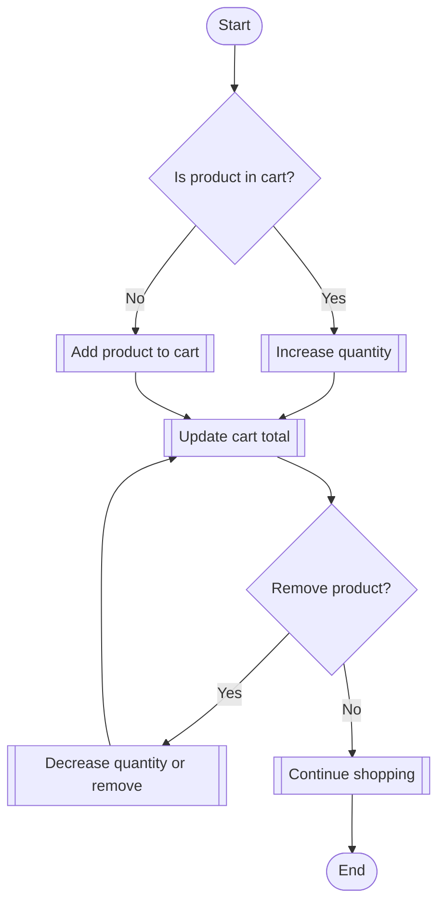

# Model Flowchart

Below is a graphical flowchart representation of the logic in `model.ts`.

---

This flowchart visualizes the main decision points and actions for managing a shopping cart model. You can view this diagram using any Markdown viewer that supports Mermaid diagrams.