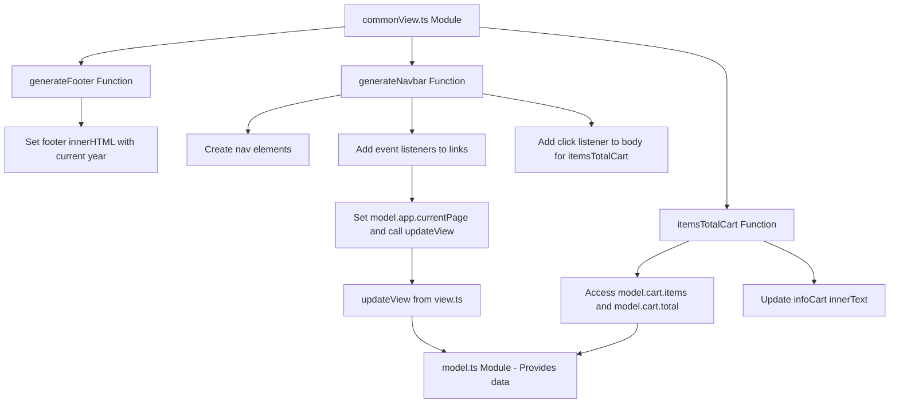

# Flowchart UML for commonView.ts Module

This flowchart represents the structure and flow of the `commonView.ts` module, including its functions and interactions with other modules (`view.ts` and `model.ts`).



### Module Descriptions

- **commonView.ts**: Main module containing view generation functions.
- **generateFooter**: Generates and returns the footer element with copyright info.
- **generateNavbar**: Creates and appends the navbar to the header, with links that update the model and view.
- **itemsTotalCart**: Updates the cart info span with item count and total from the model.
- **view.ts**: Imported module providing `updateView` function to refresh the UI.
- **model.ts**: Imported module providing the application state (e.g., cart data, current page).

```// filepath: /home/geir/Projects/GET/Frontend2025.2/2. Emne 2 og 3 - Frameworkless, Typescript og Funksjonell programering/Uke 2/Ukesoppgave/handlekurv-ts/flowchart.md

# Flowchart UML for commonView.ts Module

This flowchart represents the structure and flow of the `commonView.ts` module, including its functions and interactions with other modules (`view.ts` and `model.ts`).


### Module Descriptions

- **commonView.ts**: Main module containing view generation functions.
- **generateFooter**: Generates and returns the footer element with copyright info.
- **generateNavbar**: Creates and appends the navbar to the header, with links that update the model and view.
- **itemsTotalCart**: Updates the cart info span with item count and total from the model.
- **view.ts**: Imported module providing `updateView` function to refresh the UI.
- **model.ts**: Imported module providing the application
